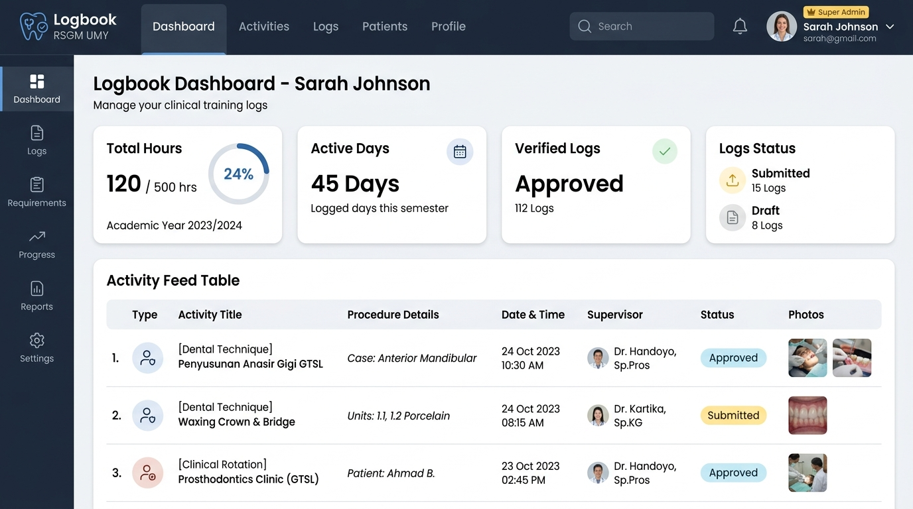
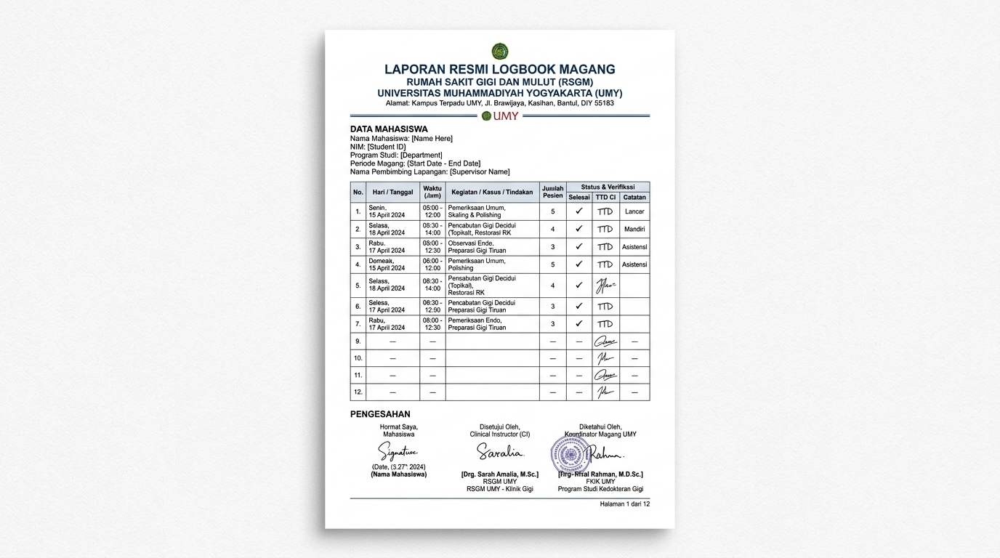

<div align="center">

# 🩺 LogbookFlex • Web Logbook Multi-Program
### Sistem Presensi & Jurnal Aktivitas Magang, KKN, PKL, dan Skripsi

[](https://nextjs.org/)
[](https://react.dev/)
[](https://www.typescriptlang.org/)
[](https://tailwindcss.com/)
[](https://supabase.com/)
[](https://vercel.com/)
[](https://opensource.org/licenses/MIT)

<p align="center">
  Aplikasi pencatatan logbook digital modern berbasis web yang fleksibel, cepat, dan siap digunakan untuk mahasiswa magang, KKN, PKL, maupun bimbingan skripsi. Terintegrasi dengan <b>Google OAuth</b>, kalkulasi durasi jam otomatis, sistem verifikasi dosen/pembimbing, dan ekspor dokumen laporan resmi berformat A4.
</p>

[Lihat Fitur](#-fitur-utama) • [Pratinjau Layar](#-tampilan-aplikasi) • [Cara Menjalankan](#-cara-menjalankan-secara-lokal) • [Panduan Deploy Vercel](#-panduan-deploy-ke-vercel)

</div>

---

## 📸 Tampilan Aplikasi

### 1. Dashboard Utama & Pelacak Aktivitas Harian
Pelacakan jam kegiatan, progress target semester, filter kategori, serta evaluasi pembimbing.


### 2. Format Laporan Resmi Siap Cetak (A4 Standard)
Dilengkapi KOP Surat Resmi Institusi, rekap jam kerja, dan kolom tanda tangan (Mahasiswa, Pembimbing Klinik, dan DPL).


---

## ✨ Fitur Utama

### 🔐 1. Autentikasi Google OAuth & Auto-Profiling
- **Gerbang Login Aman (Auth Gate)**: Mengamankan dashboard agar hanya dapat diakses setelah login.
- **Profil Otomatis**: Nama lengkap, email, dan foto avatar otomatis terisi langsung dari akun Google pengguna.
- **Mode Super Admin (`naufalfaster@gmail.com`)**: Akun admin otomatis mendapatkan hak akses verifikator penuh (Full Access).

### 🔄 2. Dukungan 5 Mode Program yang Fleksibel
Struktur form, kategori aktivitas, dan istilah pembimbing otomatis menyesuaikan:
- **Magang / Internship** (misal: Magang RSGM UMY, Lab Teknik Gigi)
- **KKN / Pengabdian Masyarakat** (Sosialisasi, program kerja desa, LPJ)
- **PKL / Praktik Kerja Lapangan** (Praktik industri, observasi teknis)
- **Skripsi / Tugas Akhir** (Bimbingan Bab 1-5, eksperimen lab)
- **Proyek / Belajar Mandiri** (Tracking portofolio & skill)

### ⏱️ 3. Kalkulasi Jam Otomatis & Analisis Progress
- Masukkan jam mulai & jam selesai, durasi jam otomatis terhitung (misal: `08:00 - 16:00` = `8.0 Jam`).
- Bar progres interaktif membandingkan jam terkumpul dengan target jam program (misal 500 jam).
- Metrik status entri: **Disetujui**, **Diajukan**, dan **Draft**.

### 📷 4. Dokumentasi Foto Bukti Kegiatan
- Upload foto bukti kegiatan langsung dari galeri atau tautan gambar.
- Dilengkapi penampil gambar resolusi tinggi (*Lightbox Modal*).

### 📄 5. Ekspor Excel & Format Cetak Laporan PDF Resmi
- **Export to CSV / Excel**: Unduh rekap logbook dengan encoding UTF-8 BOM agar langsung terbaca rapi di Microsoft Excel & Google Sheets.
- **Cetak Laporan PDF (A4)**: Didesain khusus menggunakan `@media print` sehingga saat dicetak langsung rapi tanpa terpotong.

### 👑 6. Panel Verifikator Super Admin
- **Setujui Sekaligus (Approve All)**: Tombol sekali klik untuk menyetujui seluruh logbook berstatus *Diajukan*.
- **Evaluasi Dosen/Instruktur**: Form inline untuk memberikan catatan pembimbing pada masing-masing kegiatan.

### 💎 7. Sistem Keanggotaan: Tier FREE vs PRO
- **Tier FREE**: Akses pencatatan hingga 15 entri kegiatan + ekspor laporan standar.
- **Tier PRO**: Kapasitas entri tanpa batas (*Unlimited*), cetak PDF bersih bebas watermark, dan multi-program penuh.

---

## 🛠️ Teknologi yang Digunakan

- **Framework**: [Next.js 16 (App Router)](https://nextjs.org/)
- **Bahasa**: [TypeScript 5](https://www.typescriptlang.org/)
- **Styling**: [Tailwind CSS v4](https://tailwindcss.com/)
- **Icons**: [Lucide React](https://lucide.dev/)
- **Backend & Database**: [Supabase (PostgreSQL)](https://supabase.com/) & LocalStorage Hybrid
- **Autentikasi**: Google Identity Services (GIS) & Supabase OAuth
- **Hosting / Deploy**: [Vercel](https://vercel.com/)

---

## 🚀 Cara Menjalankan Secara Lokal

### Prasyarat
- [Node.js](https://nodejs.org/) versi 18 ke atas
- NPM atau PNPM

### Langkah Instalasi
1. Clone repository ini:
   ```bash
   git clone https://github.com/naufalirfan/web-logbook.git
   cd web-logbook
   ```

2. Install seluruh dependensi:
   ```bash
   npm install
   ```

3. Jalankan server development:
   ```bash
   npm run dev
   ```

4. Buka browser Anda di `http://localhost:3000`.

---

## 🌐 Panduan Deploy ke Vercel

Proyek ini dirancang agar **100% siap langsung di-deploy ke Vercel** tanpa konfigurasi rumit:

1. Buka [https://vercel.com/new](https://vercel.com/new) dan login dengan akun GitHub Anda.
2. Cari repository **`web-logbook`**, lalu klik tombol **Import**.
3. *(Opsional)* Di bagian **Environment Variables**, Anda dapat menambahkan kredensial Supabase Anda:
   ```env
   NEXT_PUBLIC_SUPABASE_URL=https://project-anda.supabase.co
   NEXT_PUBLIC_SUPABASE_ANON_KEY=eyJhbGciOiJIUzI1NiIsIn...
   NEXT_PUBLIC_GOOGLE_CLIENT_ID=client-id-anda.apps.googleusercontent.com
   ```
4. Klik tombol **Deploy**! Web Anda akan live dalam waktu sekitar 1 menit.

---

## 🗄️ Menghubungkan Supabase Database (Opsional)

Jika ingin mengaktifkan database cloud PostgreSQL:
1. Buat project baru di [supabase.com](https://supabase.com).
2. Buka menu **SQL Editor** di sidebar Supabase.
3. Buka file [`supabase_schema.sql`](./supabase_schema.sql) di project ini, salin seluruh kodenya, tempel ke SQL Editor Supabase, lalu klik **Run**.
4. Tabel profil, tabel logbook, aturan keamanan Row Level Security (RLS), dan storage foto akan otomatis terkonfigurasi.

---

## 🤝 Berkontribusi

Kontribusi selalu disambut dengan baik!
1. Fork repository ini
2. Buat branch fitur baru (`git checkout -b feature/FiturBaru`)
3. Commit perubahan Anda (`git commit -m 'feat: Tambah fitur baru'`)
4. Push ke branch Anda (`git push origin feature/FiturBaru`)
5. Buat **Pull Request** baru

---

## 📝 Lisensi

Didistribusikan di bawah Lisensi MIT. Lihat file `LICENSE` untuk informasi lebih lanjut.

<div align="center">
  Dibuat dengan ❤️ untuk Mahasiswa dan Institusi Pendidikan Indonesia.
</div>
